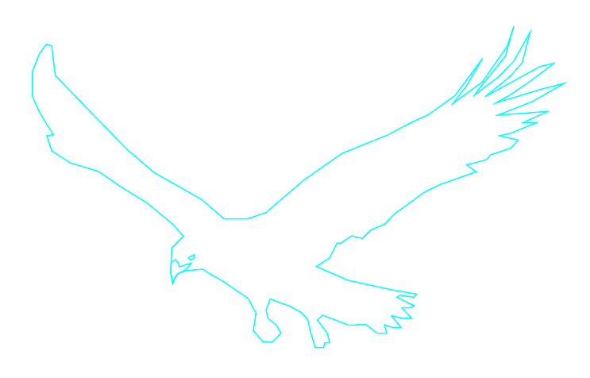

# Irisviel
A lightweight C web framework with minimal dependencies



## Usage

The only two headers that you need to create a webpage are `iris-routes.h` and `iris-main.h`.

Irisviel maintains state using the `iris_env` structure. A pointer to this structure is the first argument to *almost* all internal functions. This structure is allocated using the `iris_createEnv()` function. However, just initializing a structure does not start the server. To start the server, call the `iris_init()` function. Pass it the pointer to your structure and any flags you may need. The default 'no flags needed' is just `0`.

Routing in Irisviel works by creating a map of paths and callbacks. An Irisviel route callback always returns `char *`. These pages can be created in-code or can be loaded externally using file reading. The return value of a route callback is the page. An example of a page callback would be as follows:
```c
char *route_index(char *args){
    char *page =
        "<html>\r\n"
        "<p>Index page</p>\r\n"
        "</html>\r\n";
    
    return page;
}
```

To add a route, simply call the `iris_registerRoute()` function with: your allocated iris_env structure, the path you wish to use, and the callback.


To exit Irisviel (at program end), call the `iris_exit()` function. This function will wait for all of the threads to close. To exit Irisviel (from a user's perspective) simply hit ^C in the terminal.

## Building
This assumes you are on a UNIX system. Simply run `$ make` in the source directory. The Irisviel binary will be output into `bin/irisviel`